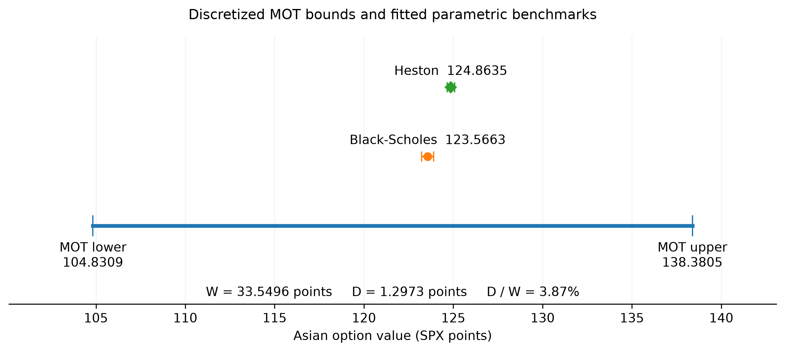
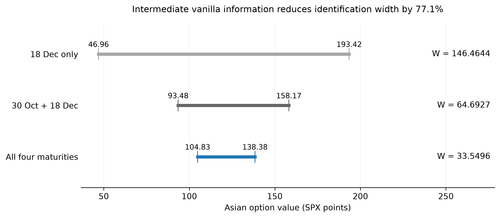
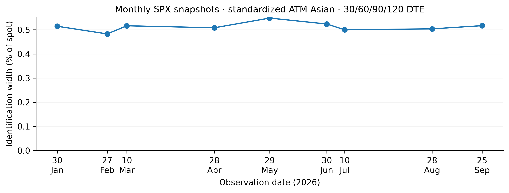

# Robust Pricing of an SPX Asian Option with Martingale Optimal Transport

A robust-pricing study of a discretely monitored arithmetic Asian option using real SPX vanilla-option prices.

The project asks a simple question:

> **How tightly can vanilla-option prices and martingale restrictions identify the value of a path-dependent Asian option?**

Rather than assuming a specific stochastic process for the underlying, the martingale optimal transport (MOT) formulation searches over admissible risk-neutral couplings consistent with observed vanilla bid/ask prices and martingale constraints. Black–Scholes and Heston valuations provide parametric benchmarks.

The main analysis uses the SPX option surface observed on **25 September 2026** for an **ATM arithmetic Asian call with strike 7,743.4102**. Its five monitoring dates are **25 September, 16 October, 30 October, 20 November and 18 December 2026**.

The admissible martingales share the parity-inferred deterministic carry curve and the chosen numerical price support.

## Main results

For the flagship market snapshot, the robust MOT interval is

$$
104.8309 \leq V_{\mathrm{Asian}} \leq 138.3805,
$$

with identification width

$$
W = U-L = 33.5496.
$$

The corresponding parametric benchmark values are

$$
V_{\mathrm{BS}} = 123.5663,
\qquad
V_{\mathrm{Heston}} = 124.8635.
$$

Their disagreement is approximately

$$
|V_{\mathrm{Heston}}-V_{\mathrm{BS}}| = 1.2973,
$$

or **3.87% of the full MOT identification width**.

Black–Scholes and Heston are mid-price-fitted benchmark models rather than exact feasible points of the MOT calibration set. The comparison therefore measures parametric benchmark dispersion relative to the robust interval; it is not a decomposition of the MOT feasible set.



## How much do intermediate vanilla maturities matter?

European options constrain risk-neutral distributions at individual maturities, but an Asian payoff depends on how those distributions are joined through time.

To quantify the value of intermediate-maturity information, the Asian contract and numerical grid are held fixed while the available vanilla maturity set is varied.

The identification width changes from

$$
146.4644
\;\longrightarrow\;
64.6927
\;\longrightarrow\;
33.5496
$$

for:

**terminal maturity only → two maturities → all four maturities**.

Using the full four-maturity vanilla information set therefore reduces the identification width by approximately **77.1%** relative to terminal information alone.



## Historical robustness

The detailed 25 September analysis is supplemented by a mechanically selected monthly panel of standardized SPX Asian contracts.

For each month from January through September 2026, archived dates are considered in descending order. The first snapshot with all four requested chains, valid cleaned quotes and parity inputs, and a valid optimal fixed-grid solve is selected. Failed attempts are retained in `historical_panel_metadata.json`; dates before month-end reflect this eligibility rule.

The historical contracts use target **30 / 60 / 90 / 120 DTE** vanilla surfaces, their actual expirations as monitoring dates, and an ATM strike. Every run uses 52 price nodes, 21 integral nodes, an 8% spot-relative support buffer, and a residual tolerance of $10^{-6}$.

Across **nine monthly snapshots**, normalized MOT identification widths range from approximately

$$
0.483\% \leq \frac{U-L}{S_0} \leq 0.548\%,
$$

with a median of approximately

$$
0.514\%.
$$

The panel is descriptive rather than a forecasting exercise, but it shows that a non-zero path-dependent pricing interval is not unique to the flagship snapshot.



## Method

For a discretely monitored arithmetic Asian call,

$$
G =
\left(
\bar S-K
\right)^+,
$$

For monitoring times $t_0=0<t_1<\cdots<t_4=T$, the weighted arithmetic average is

$$
\bar S = \frac{1}{T}\sum_{k=0}^{3}
\frac{S_{t_k}+S_{t_{k+1}}}{2}(t_{k+1}-t_k).
$$

This trapezoidal convention uses only the five monitored levels; it is not an equally weighted or continuously monitored contract. Year fractions use actual calendar days divided by 365.

Observed vanilla options impose constraints of the form

$$
C_{\mathrm{bid}}(K,T)
\leq
D(T)\,
\mathbb{E}^{\mathbb Q}
\left[
(S_T-K)^+
\right]
\leq
C_{\mathrm{ask}}(K,T).
$$

Put–call parity is used to infer the market-implied forward and discount term structures. Defining

$$
c_t=\frac{F(0,t)}{S_0},
\qquad
X_t=\frac{S_t}{c_t},
$$

removes deterministic carry so that the normalized asset satisfies the martingale condition

```math
\mathbb{E}^{\mathbb Q}
\left[
X_{t_{k+1}}
\mid
\mathcal F_{t_k}
\right]
=
X_{t_k}.
```

Because the Asian payoff depends on the running average, the numerical MOT state is augmented from the current price state to

$$
(X_t,A_t),
$$

where $A_t$ tracks the accumulated integral of the underlying.

The finite-dimensional linear programs then compute

$$
L=D(T)
\inf_{\mathbb Q\in\mathcal M}
\mathbb E_{\mathbb Q}[G],
\qquad
U=D(T)
\sup_{\mathbb Q\in\mathcal M}
\mathbb E_{\mathbb Q}[G],
$$

over admissible discrete martingale couplings consistent with the vanilla market.

$G$ is the terminal payoff, so both prices include the terminal discount factor $D(T)$.

## Numerical implementation

The MOT problem is implemented as a sparse linear program with:

- finite normalized-price and accumulated-integral state grids,
- sparse probability-flow variables,
- flow-conservation constraints,
- conditional martingale constraints,
- bid/ask vanilla-price inequalities,
- auxiliary marginal variables for efficient quote constraints,
- barycentric projection when the next accumulated-integral value lies between grid nodes.

The flagship grid has **50 price nodes and 21 integral nodes**. Checks using **50 × 25** and **52 × 21** grids change the identification width by at most approximately **0.6%**. These checks establish local numerical stability, not formal convergence to a continuous-state MOT problem. State augmentation tracks the payoff's path dependence; the finite grids and projection introduce the numerical approximation.

Black–Scholes and Heston benchmarks are calibrated to the same cleaned vanilla market. Asian benchmark values are then estimated using Monte Carlo simulation under the corresponding calibrated dynamics.

## Repository structure

```text
MOT/
├── benchmarks/
│   ├── black_scholes_asian.py
│   └── heston_asian.py
│
├── market_data/
│   ├── __init__.py
│   ├── cleaning.py
│   ├── marketdata_app.py
│   ├── parity.py
│   └── transform.py
│
├── notebooks/
│   └── final_results.ipynb
│
├── robust_pricing/
│   └── asian/
│       ├── types.py
│       ├── payoff.py
│       ├── grid.py
│       ├── solver.py
│       └── validation.py
│
├── scripts/
│   ├── build_spx_snapshot.py
│   ├── check_market_feasibility.py
│   ├── run_spx_mot.py
│   ├── run_convergence.py
│   ├── run_information_experiment.py
│   ├── run_historical_panel.py
│   └── archive_spx_history.py
│
├── results/
│   └── spx_mot/
│
├── tests/
│   ├── reference_asian_solver.py
│   ├── test_asian_inputs.py
│   └── test_asian_marginals.py
│
├── requirements.txt
├── .gitignore
└── README.md
```

`robust_pricing/asian/` contains the core MOT formulation. `benchmarks/` contains the parametric comparison models. `scripts/` contains reproducible experiment runners, while `notebooks/final_results.ipynb` is the final validation, analysis, and visualization layer.

`tests/reference_asian_solver.py` is the regression reference for the auxiliary-marginal formulation.

## Reproducing the analysis

Use **Python 3.13** and run commands from the repository root. The dependency versions record the validated environment because numerical solver and calibration behavior can vary across library versions.

```bash
python3.13 -m venv .venv
source .venv/bin/activate
python -m pip install -r requirements.txt
python -m unittest discover -s tests -v
jupyter notebook notebooks/final_results.ipynb
```

The notebook runs from the committed results without vendor data. It validates the saved contracts, bounds, information sets and historical panel. When the original processed market files are present, it additionally checks their input hashes and reevaluates vanilla fits at the saved parameters; otherwise it uses the saved fit diagnostics and figure. Neither mode reruns MOT or Monte Carlo calibration.

To execute it without the notebook interface:

```bash
jupyter nbconvert --to notebook --execute notebooks/final_results.ipynb --output final_results_executed --output-dir /tmp
```

**Market-data reproduction requires a licensed MarketData.app account.** Raw chains, the historical archive and processed quote files are excluded by `.gitignore`; redistribution rights have not been established. Local data is retained. Supply `MARKETDATA_TOKEN` through your shell or an ignored `.env` file, then recreate the flagship inputs:

```bash
python -m scripts.build_spx_snapshot
```

This writes `SPXW_clean.csv` and `term_structure.csv` under `data/processed/marketdata/2026-09-25/`. The files contain cleaned bid/ask quotes and the parity-inferred term structure. Exact validation of the committed runs requires the original file hashes recorded in `information_experiment.json`; revised vendor responses are new inputs, not a reproduction of the archived snapshot.

To recompute the research outputs from matching local inputs:

```bash
python -m scripts.run_spx_mot
python -m benchmarks.black_scholes_asian
python -m benchmarks.heston_asian
python -m scripts.run_convergence
python -m scripts.run_information_experiment
```

Both benchmarks use 500,000 antithetic paths, seed 42 and batches of 50,000. Heston uses internal steps of at most $1/1008$ years; only the five monitoring endpoints enter the Asian average. These commands perform fresh solves or calibrations; runtime depends on the solver and hardware. The information experiment has a 180-second limit per LP solve; reaching it stops regeneration. Convergence results are cached by configuration name; remove `convergence.csv` before a run with changed inputs or configurations.

For the historical panel, supply the original January–September archive under `data/archive/marketdata/YYYY-MM-DD/dte_NNN.csv`, or recreate that date range using the vendor downloader:

```bash
python -m scripts.archive_spx_history --start-date 2026-01-01 --end-date 2026-09-25
python -m scripts.run_historical_panel
```

The downloader requests the configured DTE buckets; the panel uses only 30/60/90/120. Cache reuse requires matching input and source hashes, so source edits also trigger recomputation. The saved panel, attempted failures and original hashes remain available for inspection without downloading data or solving again.

## Limitations

The reported MOT bounds correspond to a finite-state, discretely monitored numerical formulation rather than an exact continuous-state solution. The historical panel is deliberately modest and is intended as a robustness check rather than a statistical population study. Monte Carlo confidence intervals for Black–Scholes and Heston represent simulation error only and do not include calibration, specification, or discretization error.

## References

Black, F. and Scholes, M. (1973). *The Pricing of Options and Corporate Liabilities*. Journal of Political Economy, 81(3), 637–654.

Heston, S. L. (1993). *A Closed-Form Solution for Options with Stochastic Volatility with Applications to Bond and Currency Options*. Review of Financial Studies, 6(2), 327–343.

Beiglböck, M., Henry-Labordère, P. and Penkner, F. (2013). [*Model-independent bounds for option prices—a mass transport approach*](https://arxiv.org/abs/1106.5929). Finance and Stochastics, 17, 477–501.
